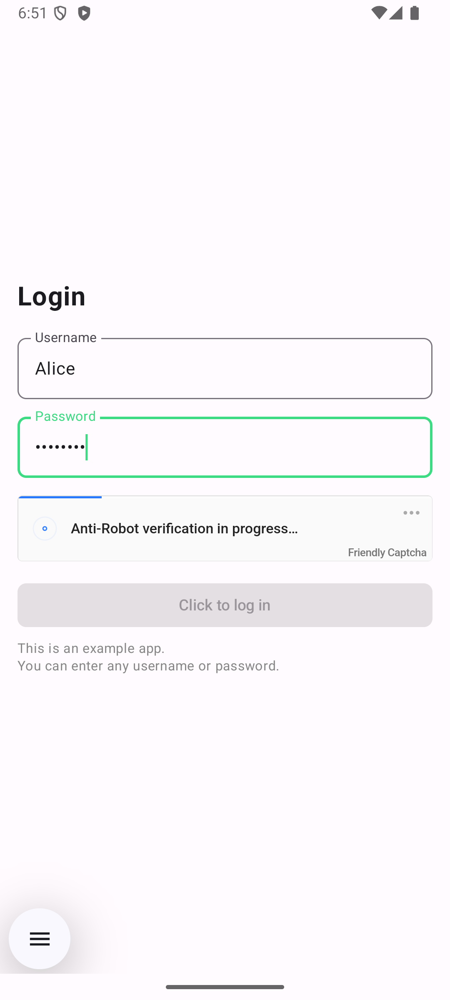

# Friendly Captcha Android SDK

[
](https://central.sonatype.com/artifact/com.friendlycaptcha.android/friendly-captcha-android) [](https://javadoc.io/doc/com.friendlycaptcha.android/friendly-captcha-android) 

The Friendly Captcha Android SDK allows you to easily integrate [Friendly Captcha](https://friendlycaptcha.com) into your Android applications.

> This SDK is for **Friendly Captcha v2**.

## Installation

Add the following to your `build.gradle` file:

```gradle
repositories {
    mavenCentral()
}

dependencies {
    implementation "com.friendlycaptcha:friendlycaptcha-android:1.0.1"
    // Or for `build.gradle.kts`
    // implementation("com.friendlycaptcha:friendlycaptcha-android:1.0.1")
}
```

You can find the latest version number on the [Releases](https://github.com/FriendlyCaptcha/friendly-capthca-android/releases) page.

## Documentation

See the documentation for the full API reference [here](https://javadoc.io/doc/com.friendlycaptcha.android/friendly-captcha-android).

## Supported Platforms

The SDK supports **Android 4.1 Jelly Bean** (API level 16, released June 2012) and above. 

This SDK is written in Kotlin and is compatible with both Kotlin and Java.

## Usage

### Kotlin (Compose)

Import the Friendly Captcha SDK

```kotlin
import com.friendlycaptcha.android.sdk.*;
```

Then create an instance of `FriendlyCaptchaSDK`, and create a widget with your site key:

```kotlin
const val FRIENDLY_CAPTCHA_SITEKEY = "YOUR_SITEKEY"

class MainActivity : ComponentActivity() {
    private val sdk by lazy {
        FriendlyCaptchaSDK(context = this, apiEndpoint = "global")
    }

    private val widget by lazy {
        sdk.createWidget(sitekey = FRIENDLY_CAPTCHA_SITEKEY)
    }

    // ...
}
```

Then in the UI you are going to use the widget, add the following:

```kotlin
    val captchaResponse = remember { mutableStateOf("") }
    var buttonEnabled by remember { mutableStateOf(false) }

    widget.setOnStateChangeListener { event ->
        captchaResponse.value = event.response

        when (event.state) {
            "completed" -> buttonEnabled = true
            // The user will be able to restart the widget by clicking it.
            "expired" -> buttonEnabled = false
            // We enable the button on errors too, if Friendly Captcha is misbehaving (i.e. it's offline),
            // the user can still submit the form (albeit without a valid captcha response).
            "error" -> buttonEnabled = true
            "reset" -> buttonEnabled = false
        }
    }

    // The rest of your UI

    AndroidView( // This is a Compose view that wraps the Friendly Captcha widget
        factory = { _ ->
            widget.view
        },
    )

    Button(
        onClick = {
            // Do something with the captcha response - usually you would send it to your backend
            // for verification, along with the rest of the form data.
            Log.d("MainActivity", "Captcha response: ${captchaResponse.value}")

            // Reset the widget after submitting the form, the captcha response is only valid once.
            widget.reset()
        },
        enabled = buttonEnabled
    ) {
        Text("Submit")
    }
```

For a full end-to-end example see the [example app](./example-app/).


### Kotlin (AndroidView)

If you are not using Jetpack Compose, you can use the `AndroidView` API to embed the widget in your existing Android views. An example for that
can be found in the [debugapp](./sdk/debugapp/src/main/java/com/friendlycaptcha/android/debugapp/MainActivity.kt).

### Kotlin Example App


The example app demonstrates how to use the Friendly Captcha SDK in a simple Android app.

To run the example app, clone this repository and open the [`example-app`](./example-app) directory in Android Studio.

## License
The Friendly Captcha Android SDK is released under Mozilla Public License 2.0 (MPL 2.0) license. See the [LICENSE](./sdk/LICENSE) file.

All examples are released under the MIT license. See the [LICENSE](./example-app/LICENSE) file.
